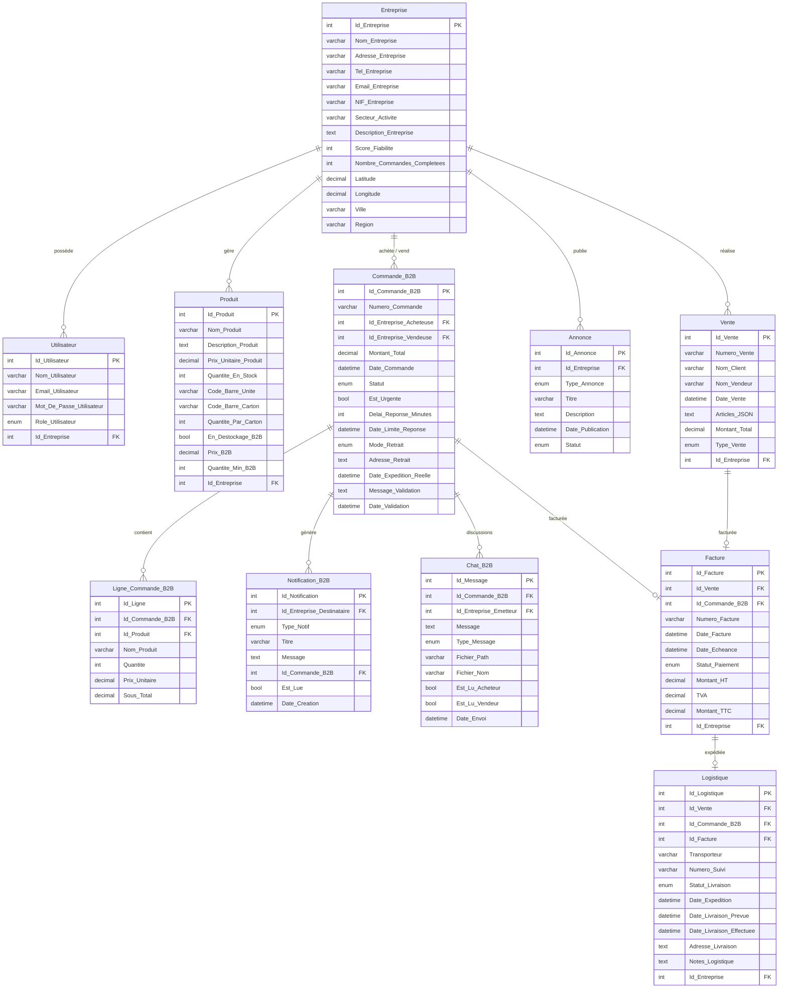

# 📋 Rapport Complet — Projet FactuPro
2
> **Date du rapport** : 14 août 2026  
> **Chemin du projet** : `c:\laragon\www\facturation`  
> **Type** : Application Web PHP — Projet BTS

---

## 1. 🎯 Vue d'ensemble

**FactuPro** est une application web de gestion de facturation et de commerce inter-entreprises (B2B) destinée aux PME. Elle centralise la gestion des stocks, des ventes, des factures, de la logistique et des commandes B2B dans une seule interface.

| Élément | Valeur |
|---|---|
| **Langage principal** | PHP 8.0+ |
| **Base de données** | MySQL / MariaDB |
| **Connexion BDD** | PDO avec préparation des requêtes |
| **Environnement** | Laragon (local) + Docker (alternatif) |
| **Dépendance PHP** | `vlucas/phpdotenv ^5.6` |
| **Fonts** | Inter & Poppins (Google Fonts) |
| **Icônes** | Font Awesome 6.4.0 |
| **Sécurité sessions** | Timeout 15 min, CSRF token, bcrypt |

---

## 2. 🗂️ Arborescence Complète des Fichiers

```
facturation/
│
├── 📄 index.php                    # Point d'entrée — redirige login ou dashboard
├── 📄 composer.json                # Dépendances PHP (phpdotenv)
├── 📄 composer.lock
├── 📄 check_db.php                 # Script de test de connexion BDD
├── 📄 scratch_drop.php             # Script utilitaire (dev)
├── 📄 .env                         # Variables d'environnement (non committé)
├── 📄 .env.example                 # Modèle de configuration
├── 📄 .gitignore
├── 📄 .dockerignore
├── 📄 Dockerfile                   # Image PHP 8.2 + Apache
├── 📄 docker-compose.yml           # Stack complète (App + MySQL + phpMyAdmin)
├── 📄 README.md
│
├── 📁 config/
│   └── db.php                      # Connexion PDO via phpdotenv
│
├── 📁 database/
│   ├── facturation.sql             # Schéma SQL (11 tables)
│   ├── seed.php                    # Script d'insertion de données de test
│   ├── seed_data.sql               # Données de démo (SQL)
│   └── migrate_json_to_lignes.php  # Script de migration Articles_JSON → Ligne_Commande_B2B
│
├── 📁 includes/
│   ├── auth.php                    # Middleware d'authentification + CSRF
│   ├── header.php                  # Navigation (navbar + polling notifications)
│   ├── b2b_helpers.php             # Fonctions métier B2B partagées
│   └── logout.php                  # Déconnexion et destruction session
│
├── 📁 pages/
│   ├── login.php                   # Page de connexion
│   ├── register.php                # Page d'inscription
│   ├── dashboard.php               # Tableau de bord principal
│   ├── products.php                # CRUD produits + options B2B
│   ├── approvisionnement.php       # Entrée de stock (réception marchandises)
│   ├── sales.php                   # Historique des ventes
│   ├── invoice_add.php             # Création d'une vente / facture
│   ├── invoice_view.php            # Visualisation d'une facture
│   ├── invoices.php                # Liste des factures
│   ├── clients.php                 # Base clients
│   ├── client_history.php          # Historique d'un client
│   ├── logistique.php              # Suivi des expéditions
│   ├── logistique_edit.php         # Édition d'un suivi logistique
│   ├── reseau_b2b.php              # Annuaire des entreprises + carte
│   ├── commandes_b2b.php           # Gestion complète des commandes B2B (1795 lignes)
│   ├── annonces.php                # Appels d'offres et partenariats
│   ├── notifications_b2b.php       # Centre de notifications B2B
│   ├── vente_workflow.php          # Workflow de vente guidé
│   ├── team.php                    # Gestion d'équipe (admin uniquement)
│   ├── settings.php                # Paramètres entreprise (admin uniquement)
│   └── test_session.php            # Outil de debug session (dev)
│
├── 📁 api/
│   ├── chat_b2b.php                # API AJAX — Messagerie B2B par commande
│   └── notifications.php           # API AJAX — Comptage des notifications non lues
│
├── 📁 assets/
│   └── css/
│       └── style.css               # Feuille de style principale (12 277 octets)
│
├── 📁 views/
│   └── home.php                    # Vue home (460 octets)
│
└── 📁 vendor/                      # Autoloader Composer (vlucas/phpdotenv)
```

---

## 3. 🗄️ Schéma de la Base de Données

### 11 tables actives



### ENUMs utilisées

| Table | Colonne | Valeurs possibles |
|---|---|---|
| `Utilisateur` | `Role_Utilisateur` | `admin`, `utilisateur` |
| `Vente` | `Type_Vente` | `directe`, `b2b` |
| `Annonce` | `Type_Annonce` | `appel_offre`, `partenariat` |
| `Annonce` | `Statut` | `active`, `expiree`, `terminee` |
| `Commande_B2B` | `Statut` | `en_attente`, `validee`, `expediee`, `livree`, `refusee` |
| `Commande_B2B` | `Mode_Retrait` | `livraison`, `retrait_place` |
| `Notification_B2B` | `Type_Notif` | `nouvelle_commande`, `commande_urgente`, `nouveau_message`, `validation`, `refus`, `livraison`, `expedition` |
| `Chat_B2B` | `Type_Message` | `texte`, `negociation_qte`, `negociation_delai`, `confirmation_dispo`, `fichier` |
| `Facture` | `Statut_Paiement` | `non_payee`, `payee`, `en_retard`, `annulee` |
| `Logistique` | `Statut_Livraison` | `traitement`, `en_attente`, `expediee`, `livree`, `annulee` |

---

## 4. ⚙️ Fonctionnalités Détaillées

### 4.1 — Authentification & Sécurité (`auth.php`)
- Session PHP avec cookie qui expire à la fermeture du navigateur
- **Timeout d'inactivité** : 15 minutes (900 secondes)
- Cache-Control `no-store` pour bloquer le bouton "Retour"
- **CSRF Token** : généré avec `bin2hex(random_bytes(32))` et validé via `hash_equals()`
- Mots de passe hachés en **bcrypt**
- Récupération automatique de `entreprise_id` depuis la BDD si absent de la session
- Polling AJAX exclu du reset du chrono d'inactivité (`$is_ajax_polling`)

### 4.2 — Tableau de Bord (`dashboard.php`)
- **Statistiques en temps réel** :
  - Chiffre d'affaires (ventes directes + commandes B2B livrées)
  - Total des achats B2B
  - Clients uniques
  - Nombre de produits en stock
  - Expéditions urgentes en attente
- **Actions rapides** : Entrée Stock, Vente Produit, Nouveau Produit, Chercher Fournisseur, Logistique
- Salutation contextuelle (Bonjour / Bonsoir selon l'heure)
- Liste des 5 dernières ventes et des commandes B2B en attente

### 4.3 — Gestion des Produits (`products.php`)
- **CRUD complet** : Création, modification, suppression sécurisée par entreprise
- Champs spécifiques B2B : `En_Destockage_B2B`, `Prix_B2B`, `Quantite_Min_B2B`
- Support codes barres : `Code_Barre_Unite`, `Code_Barre_Carton`, `Quantite_Par_Carton`

### 4.4 — Approvisionnement (`approvisionnement.php`)
- Réception de marchandises → incrémentation automatique du stock

### 4.5 — Ventes & Facturation (`invoice_add.php`, `sales.php`, `invoices.php`, `invoice_view.php`)
- Création de ventes avec **snapshot JSON des articles** (prix figés au moment de la vente)
- **Décrément automatique du stock** à chaque vente
- Génération de numéros de vente uniques
- Suivi des statuts de paiement des factures
- Historique complet des transactions

### 4.6 — Module B2B Connect

#### Réseau B2B (`reseau_b2b.php`)
- Annuaire des entreprises avec **score de fiabilité** (0–100)
- Affichage des produits en déstockage par entreprise
- Géolocalisation des entreprises (Latitude/Longitude, Ville, Région)
- Tableau des annonces (appels d'offres, partenariats)

#### Commandes B2B (`commandes_b2b.php`) — **70 208 octets, 1 795 lignes**
- **Commandes urgentes** avec compte à rebours (`Est_Urgente`, `Date_Limite_Reponse`)
- **Mode de retrait** : livraison à domicile ou retrait sur place
- **Lignes relationnelles** via `Ligne_Commande_B2B` (migration depuis Articles_JSON)
- **Contrôle de stock** avant validation côté vendeur
- **Timeline des statuts** : `en_attente → validee → expediee → livree`
- **Chat intégré par commande** (sondage AJAX toutes les X secondes)
- Notifications automatiques à chaque changement de statut

#### Chat B2B (`api/chat_b2b.php`)
- API AJAX de messagerie contextuelle par commande
- Types de messages : texte, négociation quantité/délai, confirmation disponibilité, fichier
- Suivi lu/non-lu pour acheteur et vendeur séparément
- **11 507 octets** de logique PHP

#### Notifications (`api/notifications.php`, `pages/notifications_b2b.php`)
- Polling en temps réel depuis le header (toutes les 30 secondes)
- Badge de compteur dans la navbar
- Types : nouvelle commande, commande urgente, nouveau message, validation, refus, livraison, expédition

#### Annonces (`pages/annonces.php`)
- Publication d'appels d'offres ou de propositions de partenariat
- Statuts : active, expirée, terminée

### 4.7 — Logistique (`logistique.php`, `logistique_edit.php`)
- Suivi d'expéditions lié aux ventes, commandes B2B et factures
- Informations : transporteur, numéro de suivi, adresses, dates d'expédition/livraison prévue/effective
- Statuts : `traitement`, `en_attente`, `expediee`, `livree`, `annulee`

### 4.8 — Gestion Clients (`clients.php`, `client_history.php`)
- Base clients extraite des ventes (par `Nom_Client`)
- Historique détaillé par client

### 4.9 — Gestion d'Équipe & Paramètres (Admin uniquement)
- `team.php` : Gestion des utilisateurs de l'entreprise
- `settings.php` : Paramètres de l'entreprise (infos, NIF, secteur…)

### 4.10 — Helpers B2B (`b2b_helpers.php`) — 424 lignes
- `creer_notification_b2b()` : Création de notifications + envoi email
- `envoyer_email_b2b()` : Email via `mail()` natif PHP (architecture prête pour PHPMailer/SMTP)
- Architecture SMS et WhatsApp Business préparée (commentée, prête à activer)
- Centralisation de la logique métier pour éviter la duplication

---

## 5. 🎨 Interface Utilisateur

### Design System (`assets/css/style.css` — 12 277 octets)
- Variables CSS personnalisées (`--primary`, `--danger`, `--warning`, `--shadow-*`…)
- Police **Inter** (texte) + **Poppins** (titres) via Google Fonts
- Icônes **Font Awesome 6.4.0**
- Thème clair, composants modernes

### Navigation (`includes/header.php`)
- **Navbar** fixe avec brand "FactuPro.B2B"
- Menu principal : Dash | Stocks | Réception | Ventes | Factures | Clients | Logistique
- **Burger menu dropdown** : Réseau B2B, Gestion d'équipe (admin), Paramètres (admin), Déconnexion
- **Cloche de notifications** avec badge de comptage (polling 30s)
- Responsive : menu centre masqué en dessous de 992px
- Animations d'entrée `.fade-in`

---

## 6. 🏗️ Infrastructure & Déploiement

### Développement local (Laragon)
```
URL : http://localhost/facturation
DB  : MySQL local (port 3306)
PHP : 8.0+
```

### Docker (`docker-compose.yml`)
| Service | Image | Port hôte |
|---|---|---|
| `app` | PHP 8.2 + Apache (Dockerfile) | 8080 |
| `db` | MySQL 8.0 | 3307 (évite conflit Laragon) |
| `phpmyadmin` | phpMyAdmin latest | 8081 |

- Import automatique du schéma SQL au démarrage du conteneur MySQL
- Configuration via variables d'environnement (`DOCKER_DB_*`)

### Variables d'environnement (`.env`)
```ini
DB_HOST=localhost
DB_NAME=facturation
DB_USER=root
DB_PASS=

DOCKER_DB_HOST=db
DOCKER_DB_NAME=facturation
DOCKER_DB_USER=root
DOCKER_DB_PASS=changeme
```

---

## 7. 📦 Dépendances

| Package | Version | Usage |
|---|---|---|
| `vlucas/phpdotenv` | `^5.6` | Chargement sécurisé des variables d'environnement |
| Font Awesome | `6.4.0` (CDN) | Icônes de l'interface |
| Google Fonts | Inter + Poppins | Typographie |

---

## 8. 🔐 Sécurité

| Mécanisme | Implémentation |
|---|---|
| Hachage mots de passe | `password_hash()` bcrypt |
| Protection CSRF | Token `bin2hex(random_bytes(32))` + `hash_equals()` |
| Injection SQL | PDO + requêtes préparées sur toutes les requêtes |
| XSS | `htmlspecialchars()` sur toutes les sorties utilisateur |
| Timeout session | 15 minutes d'inactivité → déconnexion automatique |
| Cache navigateur | `Cache-Control: no-store` (protection bouton Retour) |
| Isolation données | Toutes les requêtes filtrées par `Id_Entreprise` |

---

## 9. 📊 Métriques du Projet

| Métrique | Valeur |
|---|---|
| Nombre de tables BDD | 11 |
| Nombre de pages PHP | 21 |
| Nombre de fichiers includes | 4 |
| Nombre de fichiers API | 2 |
| Fichier le plus volumineux | `commandes_b2b.php` (70 208 octets, ~1 795 lignes) |
| Taille totale estimée | ~280 Ko (hors vendor) |
| Dépendances PHP | 1 (`phpdotenv`) |

---

## 10. ⚠️ Points à Améliorer / Observations

> [!NOTE]
> Ces points sont des observations techniques pour aider à l'évolution du projet.

- **`Articles_JSON` (Vente)** : Le champ JSON dans `Vente` n'a pas de table relationnelle correspondante (contrairement à `Commande_B2B` qui a `Ligne_Commande_B2B`). Une migration similaire pourrait être envisagée pour plus de cohérence.
- **Email** : Actuellement via `mail()` natif PHP. En production, PHPMailer/SMTP est recommandé (architecture déjà préparée dans `b2b_helpers.php`).
- **Pagination** : Les listes (produits, ventes, clients) pourraient bénéficier d'une pagination pour les grandes entreprises.
- **README vs code** : Le README mentionne un `bin/chat-server.php` (serveur WebSocket Ratchet) qui n'existe plus dans la structure actuelle — la messagerie est désormais en **long-polling AJAX** via `api/chat_b2b.php`.
- **`scratch_drop.php`** : Fichier de développement à ne pas oublier de supprimer en production.
- **`test_session.php`** : Outil de debug également à retirer en production.

---

*Rapport généré automatiquement le 14 août 2026.*
